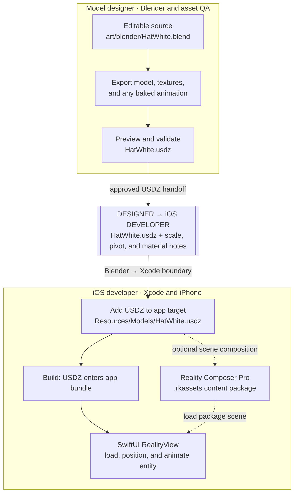

# Hats Up: practical decisions for 3D hats on iOS

This memo answers the questions raised after the design review. It assumes the app keeps its SwiftUI layout and session flow, shows low-poly hats inside that layout, and offers a low-resolution photo face as an optional feature. The companion [learning path](ios-3d-learning-path.md) covers the underlying technologies in study order.

## 1. Why not Unity?

Unity is viable, especially if Hats Up becomes a cross-platform 3D app with many animated characters. For the current design, the app's main interface is SwiftUI and the 3D content is one part of a screen. RealityKit's [`RealityView`](https://developer.apple.com/documentation/realitykit/realityview) is a SwiftUI view designed for that arrangement: it can load entities asynchronously and update them when SwiftUI state changes.

Embedding Unity in an existing native iOS app means integrating a generated Unity framework and managing its lifecycle. Unity's current [Unity as a Library documentation](https://docs.unity3d.com/Manual/UnityasaLibrary-iOS.html) says that embedded rendering is full-screen only, rather than a 3D view occupying part of a native screen. It also requires combining the Unity and native Xcode projects. Those are poor matches for a hat sitting within the existing layout. Unity becomes worth reconsidering if the product needs Android parity, game-like scenes, or a team already producing most interactions in Unity. The [official integration example](https://github.com/Unity-Technologies/uaal-example) shows what that alternative entails.

## 2. What is the Blender-to-Xcode flow? Which file goes where?

The suggested paths below are a proposed organization for the future iOS project; this repository does not yet contain an Xcode target.

The two boxes act as swimlanes for ownership and tools. The `.blend` remains the designer's editable source; the validated `.usdz` crosses the handoff boundary and becomes an Xcode resource. The dotted Reality Composer Pro path is optional for a composed scene or timeline; if the designer authors that scene, its content package is another asset to hand off. User photos are separate runtime data, never bundled with the shipped hats.

| File or artifact | Where to keep it | Purpose |
| --- | --- | --- |
| `HatWhite.blend` and other `.blend` files | A source-art directory such as `art/blender/`, outside the app target | Designer's editable source; never loaded by iOS. |
| Exported `HatWhite.usdz` | An app resource directory such as `HatsUp/Resources/Models/`, included in the app target | File RealityKit loads at runtime. Xcode must include it in the built app's resources. |
| Hat textures | Usually packaged inside the USDZ export | Keeps a hat's base-color and other textures with its mesh. |
| Optional Reality Composer Pro package (`.rkassets` in a Swift package) | A linked Reality Composer Pro content package in Xcode | Designer-authored scene composition or timelines; the app loads from that package's bundle. |
| User's selected or captured photo | App-controlled runtime storage, only if retention is needed | Input to the face-texture process; it is not part of the Xcode project or shipped app bundle. |
| Processed low-resolution face image | Generated at runtime, optionally stored in the app's data | Becomes a `TextureResource` on the UV-mapped head. |

For one rigid hat, the shortest route is: model and UV/material setup in Blender → export `.usdz` → validate with `usdchecker` → inspect appearance → add the USDZ to the Xcode app target → load it by name in `RealityView`. Blender's [USD export support](https://developer.blender.org/docs/release_notes/4.1/pipeline_assets_io/) includes armatures and shape keys, but neither is needed for a rigid hat that simply rotates or floats. Apple's [USD authoring guide](https://developer.apple.com/documentation/usd/creating-usd-files-for-apple-devices) covers material compatibility and validation; its [loading guide](https://developer.apple.com/documentation/realitykit/loading-entities-from-a-file) covers USDZ and `.reality` files. In Xcode, verify the file's target membership and resulting app bundle; a file visible in the project navigator is not enough by itself. Apple's [bundle resource guide](https://developer.apple.com/documentation/bundleresources/placing-content-in-a-bundle) explains how Xcode places resources.

If a scene needs a designer-controlled timeline, import the model into Reality Composer Pro, compose the scene there, add its content package to Xcode, and load the scene from the generated bundle. Apple's [Reality Composer Pro loading guide](https://developer.apple.com/documentation/realitycomposerpro/realitycomposerpro-essentials-previewcontentrunsimulations) shows the bundle-based load. Do not assume that a Blender animation or shader will survive export unchanged: inspect the exported result and play its clips on a physical device.

## 3. When working with USDZ in Blender, what are the nuances and caveats?

Blender can export a `.usdz` directly: choose USD export and give the output the `.usdz` extension. Blender packages the USD and its texture dependencies together. Keep the `.blend` as the editable source; treat USDZ as a build artifact, then reopen or preview that artifact before integrating it. See the [Blender USD manual](https://docs.blender.org/manual/en/4.2/files/import_export/usd.html) and Apple's [USD authoring guide](https://developer.apple.com/documentation/usd/creating-usd-files-for-apple-devices).

For this app, check these details on every test export:

- **Materials are approximations.** Blender converts a Principled BSDF setup to USD Preview Surface; arbitrary shader nodes and Blender-only effects may not look the same in RealityKit. Use simple image textures and metallic/roughness materials, and compare the USDZ in the target renderer, not just Blender's viewport. [Blender USD manual](https://docs.blender.org/manual/en/4.2/files/import_export/usd.html), [Apple USD authoring guide](https://developer.apple.com/documentation/usd/creating-usd-files-for-apple-devices).
- **Scale, axes, and origin need an art contract.** Blender and USD may use different up-axis conventions; inspect the resulting orientation, apparent size, and pivot after import. Put the hat's origin at the agreed attachment point and test it on the shared head. [Blender USD manual](https://docs.blender.org/manual/en/4.2/files/import_export/usd.html).
- **Export settings affect what is actually present.** Check selection/visibility filters, UVs, texture inclusion, and the exported frame range. For a rigid hat, animate the entity in Swift unless a specific motion really needs to be authored and exported. Blender's USD exporter supports transform animation, armatures, and relative shape keys, but has documented limits for some modifiers and rigs. [Blender USD manual](https://docs.blender.org/manual/en/4.2/files/import_export/usd.html).
- **Round-trip success is not visual fidelity.** Run `usdchecker`, preview the file, and play any embedded animation on an iPhone. Apple's guide notes that validation cannot catch every rendering or behavior problem. A [Blender-to-RealityKit example](https://github.com/radcli14/blender-to-realitykit) documents material, scale, and animation surprises in its 2024 export test. Its GLB → Reality Converter workaround is a *version-specific fallback*, not the default pipeline; try a direct USDZ export first, then change tools only if your actual asset fails. [Apple USD authoring guide](https://developer.apple.com/documentation/usd/creating-usd-files-for-apple-devices).

## 4. Is there a demo project to learn from?

Yes. These are actual Xcode projects, ordered by how directly they teach the three basics. None is a drop-in Hats Up implementation:

1. **[ARBasicApp](https://github.com/ynagatomo/ARBasicApp)** is the most compact all-in-one study project: it includes USDZ assets, loads and repositions models on a tap, plays baked model animation, and moves models procedurally in a circle. Start with its `ARSceneSpec.swift` for asset names and `AnimationModel.swift` for movement. It uses SwiftUI with `ARView` and plane detection, so learn the entity/animation ideas but do not copy its camera-based AR screen for an in-layout hat.
2. **[RealityKit 3D Model Viewer](https://github.com/webcoyote/realitykit)** focuses on the non-AR side: load a custom USDZ, pan to rotate, and pinch to zoom. It is useful for the “hat inside a screen” interaction, but it does **not** demonstrate animation playback; pair it with ARBasicApp or the next example.
3. **[Blender to RealityKit](https://github.com/radcli14/blender-to-realitykit)** includes a Blender source file and Xcode app, then loads the resulting model into SwiftUI `RealityView`, changes its transform, and explicitly calls `playAnimation` on an embedded clip. It is a good end-to-end trace of where the files and animation go. Its iPhone scene uses spatial-tracking AR and an older conversion workaround, so adapt only the relevant asset-loading and playback code.

For a focused exercise, run ARBasicApp, replace one of its USDZ files with a simple hat, then make that hat move and play a short baked clip. Next, reproduce only those behaviors in a non-AR `RealityView` inside a SwiftUI card. Apple's [`RealityView` reference](https://developer.apple.com/documentation/realitykit/realityview) is the API check for that final step.

## 5. Does low-poly make the whole process easier?

It helps with model authoring, download size, and GPU workload. A hat is also a rigid object: it can be moved, rotated, and swapped without a skeleton. Apple's [RealityKit GPU guidance](https://developer.apple.com/documentation/realitykit/reducing-gpu-utilization-in-your-realitykit-app) recommends modest polygon counts and texture sizes, especially on older devices.

Low-poly does **not** remove the need to agree on scale, pivot, orientation, materials, export settings, and testing. It also does not make a photograph automatically fit a head. The head's UV map and photo crop determine whether the face looks intentional. In practice, a shared head mesh and consistent hat attachment point may save more effort than merely reducing polygons. This is an implementation judgment based on the asset handoff and texture requirements, not an Apple performance guarantee.

## 6. Why use Vision face landmarks? Can a user align with an on-screen circle?

Yes. For a first release, an on-screen guide plus manual adjustment is reasonable. Show a face outline or eye markers in the camera preview, capture the image, then let the user pan and zoom the resulting crop before applying it to the head. The crop rectangle must correspond to the facial UV region; drawing a circle alone does not map the pixels to 3D. A simple alignment flow works best with a front-facing portrait and an art style that tolerates imperfect placement.

[Vision face landmarks](https://developer.apple.com/documentation/vision/vndetectfacelandmarksrequest) detect features such as eyes and mouth. They become valuable when users select existing photos with varied framing, when the crop should be automatic, or when misalignment becomes a frequent complaint. They do not solve the art problem of how a flat photo wraps around a low-poly head. Begin with manual alignment, measure whether people struggle, and add Vision only if it improves the result enough to justify its complexity. For capturing a new image, Apple's [`AVCapturePhotoOutput`](https://developer.apple.com/documentation/avfoundation/avcapturephotooutput) is the underlying still-photo API; [PhotosPicker](https://developer.apple.com/documentation/photosui/photospicker) covers selection from the library.

## 7. What is likely to be hardest?

For the **core hat feature**, the hardest part is a repeatable designer-to-device asset handoff: six hats must have consistent apparent size, pivot, lighting response, and visual quality in the real SwiftUI layout. A model that looks right in Blender can differ after USD export and RealityKit rendering; Apple's [USD guide](https://developer.apple.com/documentation/usd/creating-usd-files-for-apple-devices) explicitly recommends checking the target renderer because validation does not catch visual or behavioral issues.

For the **optional photo face**, the hardest part is making many real photos look deliberate on one stylized head. The crop, perspective, UV placement, side and back treatment, hat-to-head alignment, and handling of poor captures require design and iteration. A low-resolution filter is straightforward by comparison; [Core Image provides a pixelate filter](https://developer.apple.com/documentation/coreimage/cipixellate), and [RealityKit can generate a texture from an image](https://developer.apple.com/documentation/realitykit/textureresource/generateasync%28from%3Awithname%3Aoptions%3A%29).

## 8. How should we rank the high-level tasks by impact and cost?

These are **planning estimates for Hats Up**, not measured development time. Impact means contribution to the agreed visual direction and usable app experience; cost includes design, engineering, and testing. Scores are relative: 1 is low, 5 is high. Priority accounts for dependencies as well as impact and cost.

| Priority | High-level task | Impact | Cost | Reason |
| ---: | --- | ---: | ---: | --- |
| 1 | Agree on the 3D art contract: camera framing, scale, pivot, UV/material rules, named parts | 5 | 2 | Prevents repeated asset rework and lets every hat use the same app code. |
| 2 | Build one hat end to end in `RealityView`, inside the actual SwiftUI layout | 5 | 3 | Tests the central product decision and exposes rendering or layout problems early. |
| 3 | Produce and integrate the remaining hats with consistent lighting and switching | 5 | 3 | Delivers the new visual identity across all six hats. |
| 4 | Add restrained hat motion and transitions | 3 | 2 | Adds character without requiring rigs or a timeline editor. |
| 5 | Build one UV-mapped head and a manual photo crop/preview flow | 4 | 4 | Delivers the optional personalization, but needs substantial art and device testing. |
| 6 | Profile and tune on the oldest supported iPhone | 3 | 2 | Protects smooth interaction once real models and textures exist. |
| 7 | Add Vision-assisted alignment if manual results are poor | 2 | 3 | Improves convenience after the face design has been proven. |
| 8 | Add live AR face/hat tracking, if desired later | 2 | 5 | A distinct, device-dependent experience with far more camera and tracking work. |

The first milestone should be one finished hat, loaded from a real exported USDZ into the intended SwiftUI screen on an iPhone. That result will give the team a concrete basis for art rules, motion, and whether the portrait feature is worth pursuing.
